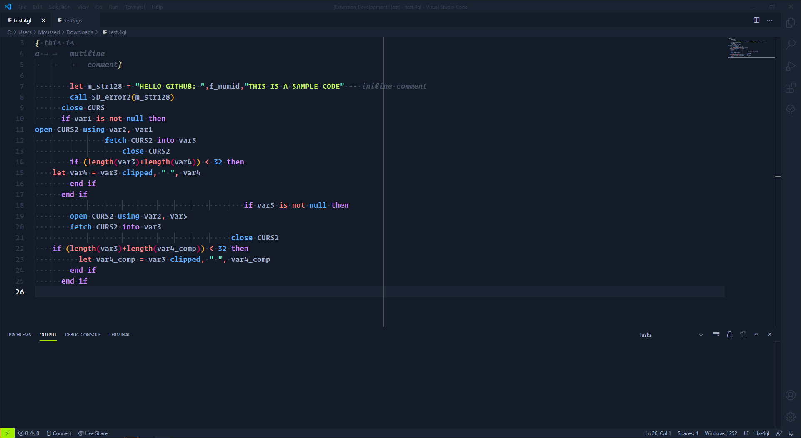
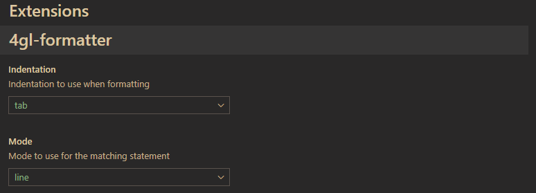
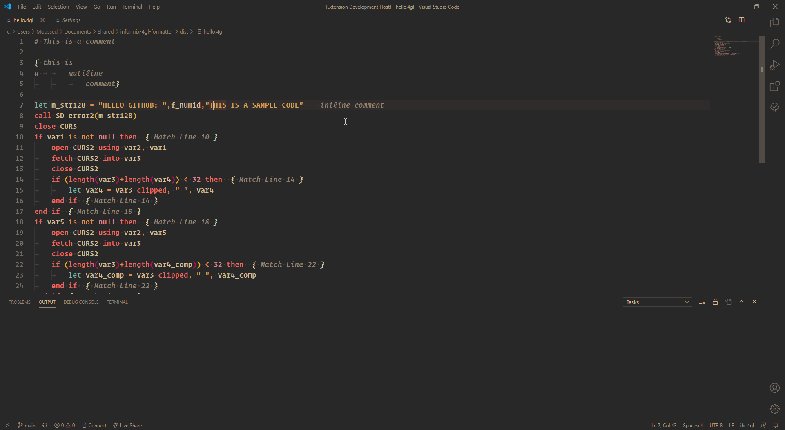

# VSCode 4gl-formatter

## Features

Indent your 4gl code to make it easier to read :

this code is lazyly adapted from [this script I made](https://github.com/Di-KaZ/informix-4gl-formatter)

> ⚠ I didn't really searched much on how to write a vscode extention, please be gentle with me 😃

## Extension Settings

* `4gl-formatter.activate`: to enable this extension

## Known Issues

## Release Notes

first version
### 0.0.1

initial release
